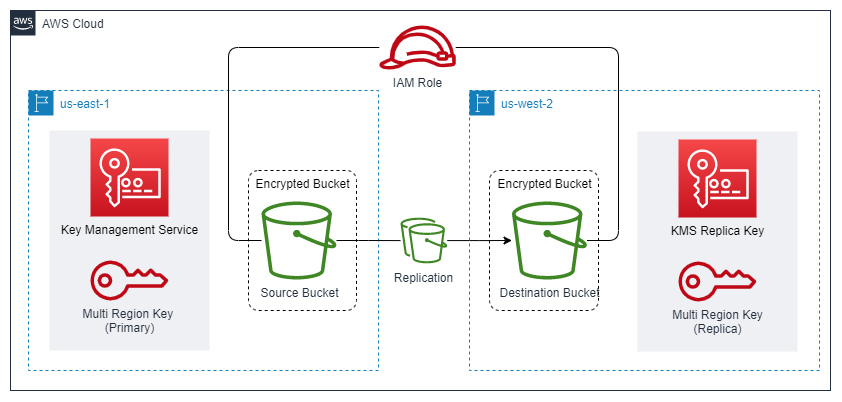

# Encrypted S3 Cross-Region Replication

This is a full demo of S3's cross-region replication functionality that adds an extra layer of complexity by encrypting the buckets with a multi-region KMS key.

## Resources deployed by this manifest:

- Multi Region KMS Key
- Source S3 Bucket
    - Public Access Blocked
    - Private
    - Encrypted
    - Versioning enabled
- Destination S3 Bucket
    - Public Access Blocked
    - Private
    - Encrypted
    - Versioning enabled
- Bucket Replication Configuration Rule
- IAM Role to allow te replication of the Encrypted Buckets

### Deployment diagram:



## Tested with: 

| Environment | Application | Version  |
| ----------------- |-----------|---------|
| WSL2 Ubuntu 20.04 | Terraform | v1.1.7  |

## Initialization How-To:

Located in the root directory, make an "aws configure" to log into the aws account, and a "terraform init" to download the necessary modules and start the backend.

```bash
aws configure
terraform init
```

## Deployment How-To:

Located in the root directory, make the necessary changes in the variables.tf file and run the manifests:

```bash
terraform apply
```

### Testing the solution:

To test the solution put a file in the source bucket. 

```bash
aws s3 cp test_file.txt s3://source-bucket-name
```
>To get the bucket name, you can use: `terraform output source_bucket_name`

## Author:

- [@JManzur](https://jmanzur.com)

## Documentation:

- Terraform Documentation:
    - [S3 Bucket Encryption](https://registry.terraform.io/providers/hashicorp/aws/latest/docs/resources/s3_bucket_server_side_encryption_configuration)
    - [AWS KMS Key](https://registry.terraform.io/providers/hashicorp/aws/latest/docs/resources/kms_key)
    - [S3 Bucket Replication Configuration](https://registry.terraform.io/providers/hashicorp/aws/latest/docs/resources/s3_bucket_replication_configuration)
- AWS Documentation:
    - [Multi-Region keys in AWS KMS](https://docs.aws.amazon.com/kms/latest/developerguide/multi-region-keys-overview.html)